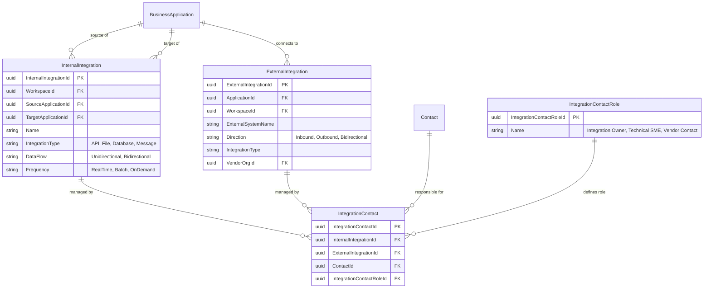

# GetInSync NextGen Conceptual ERD
## Version 1.2 - December 2025

---

## 1. Overview

This document presents the conceptual data model for GetInSync NextGen. It focuses on entity relationships and purpose rather than detailed column definitions.

### Design Principles

| Principle | Description |
|-----------|-------------|
| **Multi-tenant by design** | Region → Namespace → Workspace hierarchy |
| **Identity separated from access** | Individual (who you are) vs Contact (what you can do here) |
| **Transparency by default** | Users see everything in their Workspace unless explicitly restricted |
| **Licensing ≠ Permissions** | Editor Pool (capacity) is separate from WorkspaceRole (permissions) |
| **Steward enables owners** | Application Owners can self-serve without Editor licenses |
| **TBM-lite cost transparency** | Budget-to-actual, vendor reporting, application TCO |

### What's New in v1.2

| Enhancement | Description |
|-------------|-------------|
| **ITServiceContract** | NEW junction table linking ITService to ProductContract |
| **Budget-to-Actual** | BudgetedAnnualCost + ActualAnnualCost on ITService |
| **Budget-to-Actual** | BudgetedCost + AnnualCost on ProductContract |
| **FiscalYear** | Year-over-year tracking on ITService and ProductContract |
| **Free-Standing DPs** | DeploymentProfiles with ApplicationId = NULL for non-app costs |
| **CostCategory** | Five TBM-lite cost buckets (Namespace-scoped) |

### What Was in v1.1

| Enhancement | Description |
|-------------|-------------|
| **CostCategory lookup** | Five high-level cost buckets aligned with TBM |
| **Direct vs Allocated costs** | Explicit separation to prevent double-counting |
| **Free-Standing DPs** | Replaced "Central IT pseudo-application" pattern |
| **Cost flow documentation** | Clear rules for cost aggregation |

### Related Documents

| Document | Content |
|----------|---------|
| archive/superseded/identity-security-v1_0.md | Full RBAC model, authentication, SOC 2 |
| marketing/pricing-model.md | Tiers, licensing, Steward availability |
| core/involved-party.md | Individual, Contact, Organization details |
| core/core-architecture.md | Workspace, Namespace, WorkspaceGroup |
| marketing/explainer.md | Cost model rationale and TBM-lite philosophy |

---

## 2. High-Level Overview


---

## 3. Domain Clusters

### 3.1 Platform & Tenancy

This cluster defines the multi-tenant hierarchy and data isolation boundaries.


#### Entity Descriptions

| Entity | Purpose | Scope |
|--------|---------|-------|
| **Region** | Physical deployment boundary; data residency | Platform |
| **Namespace** | Billing/tenant boundary; holds Editor Pool | Customer |
| **Workspace** | Data isolation boundary; ministry/department | Department |
| **WorkspaceGroup** | Reporting aggregation; federated catalog visibility | Namespace |

#### Key Relationships

- One **Region** hosts many **Namespaces** (data residency)
- One **Namespace** contains many **Workspaces** (tenant boundary)
- **Workspaces** can belong to multiple **WorkspaceGroups** (M:N via membership)
- **WorkspaceGroup.IsCatalogPublisher** controls federated catalog visibility

---

### 3.2 Identity & Access

This cluster defines who users are and what they can do.


#### Entity Descriptions

| Entity | Purpose | Scope |
|--------|---------|-------|
| **Individual** | Real person identity; Entra ID anchor | Platform |
| **Contact** | Person as seen in a Workspace; holds WorkspaceRole | Workspace |
| **Portfolio** | Grouping of Applications; scope for Editor permissions | Workspace |
| **PortfolioContact** | Assigns Portfolio roles to Contacts | Workspace |

#### WorkspaceRole Values

| Role | Can Create | Can Edit | Can View | Dashboard | License |
|------|------------|----------|----------|-----------|---------|
| **Admin** | ✅ All | ✅ All | ✅ All | ✅ | Editor |
| **Editor** | ✅ All | ✅ Assigned Portfolios | ✅ All | ✅ | Editor |
| **Steward** | ❌ | ✅ Owned Apps (Business Fit) | ✅ All | ✅ | Steward |
| **ReadOnly** | ❌ | ❌ | ✅ All | ✅ | Free |
| **Restricted** | ❌ | ❌ | ⚠️ Assigned only | ❌ | Free |

#### PortfolioRole Values

| Role | Add/Remove Apps | Edit Apps | View Apps |
|------|-----------------|-----------|-----------|
| **Owner** | ✅ | ✅ | ✅ |
| **Contributor** | ❌ | ✅ | ✅ |
| **Viewer** | ❌ | ❌ | ✅ |

#### Key Relationships

- One **Individual** can have many **Contacts** (one per Workspace)
- **Contact.WorkspaceRole** determines base permissions in that Workspace
- **PortfolioContact** refines scope for Editors (which apps they can edit)
- **Portfolio.IsRestricted** limits visibility for Restricted users

---

### 3.3 Steward & Application Ownership

This cluster shows how Steward rights are derived from Contact assignments.


#### Steward Derivation Rule

```
Contact has Steward rights on Application IF:
  1. Contact is assigned to Application via ApplicationContact
  2. RefContactType.GrantsStewardRights = true
  3. (If delegated) DelegationExpiresAt > Now
```

#### Steward Permissions

| Field Type | Steward Can Edit |
|------------|------------------|
| Business Fit (TIME) | ✅ |
| Application metadata | ✅ |
| Technology Fit | ❌ |
| Deployment Profiles | ❌ |
| Costs | ❌ |

---

### 3.4 Involved Parties

This cluster shows how Organizations and Contacts relate to business entities.


#### Entity Descriptions

| Entity | Purpose | Scope |
|--------|---------|-------|
| **Organization** | External vendor or internal division | Namespace |
| **SoftwareProduct** | Commercial software (not apps, not IT services) | Namespace |
| **ProductContract** | Vendor agreement for software/services | Workspace |

#### Organization Roles

| Role Flag | Purpose |
|-----------|---------|
| **IsSupplier** | Can be assigned to ProductContract.SupplierOrgId |
| **IsManufacturer** | Can be assigned to SoftwareProduct.ManufacturerOrgId |
| **IsCustomer** | Can be assigned as a business customer (future) |
| **IsInternalOrg** | Internal divisions (e.g., "Central IT"); excluded from vendor reports |

#### UI Presentation (Filtered Views)

The backend uses a unified "Organization" entity, but the UI presents filtered views based on role flags:

| UI View | Filter | Access |
|---------|--------|--------|
| **Vendors** | IsSupplier = true | All users |
| **Manufacturers** | IsManufacturer = true | All users |
| **Organizations** | No filter | Admins only |

**Contextual Labels:**
- ProductContract form shows "Vendor" (not "Organization")
- SoftwareProduct form shows "Manufacturer" (not "Organization")

See **core/involved-party.md** Section 3.3.1 for full specification.

---

### 3.5 Core APM

This cluster shows the primary application portfolio entities.


#### Entity Descriptions

| Entity | Purpose |
|--------|---------|
| **BusinessApplication** | The core APM entity; an application in the portfolio |
| **Portfolio** | Grouping mechanism for applications (logical grouping) |
| **Program** | Strategic initiative containing projects |
| **Project** | Delivery unit that impacts applications |

#### Free-Standing Deployment Profiles (Non-Application Costs)

**CRITICAL RULE:** Never create "dummy" Business Applications to hold costs. BusinessApplication is reserved for business-facing applications used in TIME/PAID analysis.

Instead, use **Free-Standing Deployment Profiles** — DeploymentProfiles where `ApplicationId = NULL`.

| Attribute | Description |
|-----------|-------------|
| ApplicationId | NULL (no parent application) |
| PortfolioId | Links to Portfolio for reporting |
| Name | e.g., "O365 – Org Wide", "Azure Shared Infrastructure" |
| Purpose | Anchor costs that don't belong to a specific app |

**Examples of Free-Standing DPs:**

| DP Name | What It Captures |
|---------|------------------|
| "O365 – Org Wide" | Microsoft 365 licenses not tied to one app |
| "Canva – Marketing" | SaaS spend for a specific department |
| "DocuSign – Legal" | Tool used by a group, not a full APM application |
| "Azure Shared Infrastructure" | Cloud hosting for multiple apps |
| "IT Governance & Compliance" | Audit costs, compliance tools |

**Why This Matters:**
- Keeps the Business Application portfolio clean for TIME analysis
- Prevents APM counts from being skewed by dummy apps
- Costs still roll up to Portfolio and Workspace reports

---

### 3.6 Deployment & Cost

This cluster shows where applications run and what they cost. **Enhanced in v1.1** with TBM-lite cost model support.


#### Cost Categories (TBM-lite)

Five high-level categories aligned with Technology Business Management principles:

| Category | Description | Examples |
|----------|-------------|----------|
| **Infrastructure & Cloud** | Hardware, networking, cloud IaaS/PaaS | AWS, Azure, data centers, WAN/LAN |
| **Applications & Software** | Software licenses, SaaS subscriptions | Microsoft 365, Salesforce, SAP |
| **IT Labor & Services** | Internal staff, contractors, managed services | FTEs, consultants, outsourced support |
| **End-User Computing** | Devices, help desk, user tools | Laptops, peripherals, service desk |
| **Security & Compliance** | Security tools, audits, DR | SIEM, firewalls, backup, compliance |

CostCategory is **Namespace-scoped** — shared across all Workspaces. Customers can customize categories to match their chart of accounts.

#### Cost Model (Enhanced in v1.2)

**Two Cost Paths:**

| Path | Use Case | Flow |
|------|----------|------|
| **Shared Infrastructure** | Costs shared by multiple apps | Contract → ITServiceContract → ITService → DeploymentProfileITService → DP |
| **App-Specific** | License for one application | Contract → DeploymentProfileContract → DP |

**Budget vs. Actual:**

| Entity | Budget Field | Actual Field | Variance |
|--------|--------------|--------------|----------|
| **ITService** | BudgetedAnnualCost | ActualAnnualCost (from contracts) | Calculated |
| **ProductContract** | BudgetedCost | AnnualCost (invoice) | Calculated |
| **DeploymentProfile** | — | TotalCost (calculated) | — |

**Key Insight:** Budget is set at the source (ITService or Contract). Actuals flow through allocations to DeploymentProfiles.

```
┌─────────────────────────────────────────────────────────────────────────┐
│                         COST FLOW DIAGRAM                               │
├─────────────────────────────────────────────────────────────────────────┤
│                                                                         │
│  PATH 1: SHARED INFRASTRUCTURE                                          │
│  ─────────────────────────────                                          │
│                                                                         │
│  ProductContract ──► ITServiceContract ──► ITService                    │
│  (Azure EA: $80K)    (100%)                 (Azure Hosting)             │
│                                                  │                      │
│                      ┌───────────────────────────┼───────────────┐      │
│                      ▼                           ▼               ▼      │
│              DeploymentProfile          DeploymentProfile    DeploymentProfile
│              (App A: 40%)               (App B: 35%)         (App C: 25%)
│              = $32,000                  = $28,000            = $20,000  │
│                                                                         │
│  PATH 2: APP-SPECIFIC LICENSE                                           │
│  ────────────────────────────                                           │
│                                                                         │
│  ProductContract ──► DeploymentProfileContract ──► DeploymentProfile    │
│  (Tyler: $45K)       (100%)                        (Utility Billing)    │
│                                                                         │
│  PATH 3: FREE-STANDING (Non-App Costs)                                  │
│  ─────────────────────────────────────                                  │
│                                                                         │
│  ProductContract ──► DeploymentProfileContract ──► Free-Standing DP     │
│  (O365 Org-Wide)     (100%)                        (ApplicationId=NULL) │
│                                                         │               │
│                                                         ▼               │
│                                                    Portfolio            │
│                                                                         │
└─────────────────────────────────────────────────────────────────────────┘
```

#### ITService Cost Calculation

```
ITService.ActualAnnualCost = Sum(ITServiceContract.AllocatedCost)

ITService.Variance = ActualAnnualCost - BudgetedAnnualCost

ITService.StrandedCost = ActualAnnualCost - Sum(DeploymentProfileITService.AllocatedCost)
```

#### DeploymentProfile Cost Calculation

```
DeploymentProfile.TotalCost =
    DirectCost                           (manually entered)
  + AllocatedContractCost               (sum of contract allocations)
  + AllocatedServiceCost                (sum of IT service allocations)
```

| Field | Source | Purpose |
|-------|--------|---------|
| **DirectCost** | Manual entry | Costs specific to this deployment (consulting, one-time fees) |
| **AllocatedContractCost** | Calculated | Sum of DeploymentProfileContract.AllocatedCost |
| **AllocatedServiceCost** | Calculated | Sum of DeploymentProfileITService.AllocatedCost |
| **TotalCost** | Calculated | Sum of all three |

#### Application TCO Calculation

```
Application TCO =
    Sum(DeploymentProfile.TotalCost for all profiles)
```

#### IT Service Stranded Cost

```
ITService.StrandedCost = ActualAnnualCost − Sum(DeploymentProfileITService.AllocatedCost)
```

Stranded cost represents shared infrastructure overhead not yet attributed to specific applications. It is:
- **Visible** in reports (CFO transparency)
- **Attributed** to the ServiceOwnerContact (accountability)
- **Optionally allocated** to a Free-Standing Deployment Profile for reporting

#### Allocation Methods

| Method | Description | Use Case |
|--------|-------------|----------|
| **Manual** | User enters percentage | Default, flexible |
| **ByUsers** | Calculated from user counts | Fair share by headcount |
| **ByVMs** | Calculated from VM counts | Infrastructure allocation |

Note: ByUsers and ByVMs are **v2 enhancements**. v1 supports Manual only.

#### Cost Validation Rules

| Rule | Validation | Severity |
|------|------------|----------|
| Sum of allocations ≤ 100% | Warning if exceeded | Warning |
| Sum of allocations ≤ 105% | Error if exceeded | Error |
| Contract allocation same Workspace | Enforced | Error |
| Stranded cost > 20% of total | Flag for review | Warning |

#### Avoiding Double-Counting

The key to TBM-lite is **never counting the same dollar twice**:

| Cost Type | Where It Lives | Where It Doesn't Live |
|-----------|----------------|----------------------|
| Contract cost (actual) | ProductContract.AnnualCost | (nowhere else) |
| Allocated to IT Service | ITServiceContract.AllocatedCost | DeploymentProfile directly |
| IT Service to app | DeploymentProfileITService.AllocatedCost | (rolled up to DP) |
| Contract to app directly | DeploymentProfileContract.AllocatedCost | ITService |
| Stranded/unallocated | ITService.StrandedCost | Applications |

**Rule:** A contract flows to apps either via ITService OR via direct DeploymentProfileContract — never both.

---

### 3.7 Integrations

This cluster shows how applications connect to each other and external systems.



#### Entity Descriptions

| Entity | Purpose |
|--------|---------|
| **InternalIntegration** | Connection between two applications in the same Workspace |
| **ExternalIntegration** | Connection to a system outside GetInSync |
| **IntegrationContact** | Who is responsible for the integration |

---

### 3.8 TIME Model (Business & Technology Fit)

This cluster shows how applications are scored.


#### TIME Model Components

| Component | Description | Who Can Edit |
|-----------|-------------|--------------|
| **Business Fit** | Business value, criticality, user satisfaction | Steward, Editor |
| **Technology Fit** | Technical health, supportability, security | Editor only |

#### Assessment Workflow (v2 Feature)

1. Facilitator initiates **TIMEAssessment** for an Application
2. System creates **TIMEAssessmentInvite** records with one-time tokens
3. Stakeholders (no account required) submit **TIMEAssessmentResponse**
4. Facilitator reviews, aggregates, and finalizes **TIMEResponse**

---

## 4. Entity Summary

### All Entities by Scope

| Scope | Entities |
|-------|----------|
| **Platform** | Region, Individual |
| **Namespace** | Namespace, Organization, WorkspaceGroup, TIMEQuestion (custom), CostCategory, SoftwareProduct |
| **Workspace** | Workspace, Contact, Portfolio, BusinessApplication, DeploymentProfile, ITService, ProductContract, Program, Project, InternalIntegration, ExternalIntegration, TIMEResponse |
| **Cross-Workspace** | WorkspaceGroupMembership (M:N) |

### New Entities (NextGen)

| Entity | Purpose | Replaces/Extends |
|--------|---------|------------------|
| **Region** | Data residency boundary | New |
| **Namespace** | Billing/tenant boundary | Extends Account hierarchy |
| **Individual** | Platform-scoped identity | New (was embedded in Contact) |
| **WorkspaceRole** | Permission level in Workspace | New (was implicit) |
| **RefContactType.GrantsStewardRights** | Enables Steward derivation | New field |
| **TIMEAssessment** | Multi-stakeholder scoring (v2) | New |
| **CostCategory** | TBM-lite cost classification | New in v1.1 |
| **ITServiceContract** | Links ITService to ProductContract | New in v1.2 |

### New Fields (v1.2)

| Entity | Field | Purpose |
|--------|-------|---------|
| **ITService** | FiscalYear | Year for budget tracking |
| **ITService** | BudgetedAnnualCost | Planned spend |
| **ITService** | ActualAnnualCost | Calculated from linked contracts |
| **ITService** | Variance | Actual - Budget |
| **ProductContract** | FiscalYear | Year for budget tracking |
| **ProductContract** | BudgetedCost | Planned spend |
| **ProductContract** | Variance | Actual - Budget |

### New Fields (v1.1)

| Entity | Field | Purpose |
|--------|-------|---------|
| **DeploymentProfile** | ApplicationId | Now nullable — NULL for free-standing DPs |
| **DeploymentProfile** | PortfolioId | For free-standing DPs (links to Portfolio for reporting) |
| **DeploymentProfile** | DirectCost | Costs specific to this deployment |
| **DeploymentProfile** | AllocatedContractCost | Calculated sum of contract allocations |
| **DeploymentProfile** | AllocatedServiceCost | Calculated sum of IT service allocations |
| **DeploymentProfile** | TotalCost | Computed total (Direct + Allocated) |
| **ITService** | CostCategoryId | Links to cost bucket |
| **ITService** | AllocatedCost | Sum of DP allocations |
| **ITService** | StrandedCost | Unallocated portion |
| **ITService** | ServiceOwnerContactId | Who owns this service |
| **ProductContract** | CostCategoryId | Links to cost bucket |
| **DeploymentProfileITService** | AllocationMethod | How allocation was determined |

### Renamed Entities

| Legacy Name | NextGen Name |
|-------------|--------------|
| Account | Workspace |
| Parent Account | Namespace |
| (implicit) | Individual |
| (implicit) | WorkspaceRole |

---

## 5. Reports Enabled by Cost Model

The enhanced cost model enables these TBM-lite reports:

| Report | Description |
|--------|-------------|
| **Budget vs. Actual by IT Service** | Compare planned vs. invoice by service |
| **Budget vs. Actual by Contract** | Compare planned vs. invoice by vendor contract |
| **Year-over-Year by IT Service** | FY2024 vs. FY2025 vs. FY2026 trending |
| **Spend by Vendor** | Total actual spend grouped by SupplierOrg |
| **Spend by Manufacturer** | Total spend grouped by ManufacturerOrg |
| **Spend by IT Service** | Total actual by shared infrastructure service |
| **Spend by Cost Category** | Breakdown by TBM category (Infra, Apps, Labor, etc.) |
| **Application TCO** | Total cost per application (direct + allocated) |
| **Stranded Cost** | Infrastructure costs not yet allocated to apps |
| **Portfolio Cost** | Total cost for a group of applications |
| **Workspace Cost** | Total IT spend for a ministry/department |
| **Namespace Cost** | Total IT spend across all Workspaces |

---

## 6. Change Log

| Version | Date | Changes |
|---------|------|---------|
| v1.0 | 2025-12-14 | Initial conceptual ERD covering all domain clusters |
| v1.1 | 2025-12-16 | Enhanced cost model: CostCategory, DirectCost, AllocatedCost, StrandedCost, AllocationMethod. Free-Standing Deployment Profiles for non-application costs. |
| v1.2 | 2025-12-19 | Budget-to-Actual: Added ITServiceContract junction, BudgetedAnnualCost/ActualAnnualCost on ITService, BudgetedCost/AnnualCost on ProductContract, FiscalYear on both. Year-over-year tracking. |

---

End of document.
